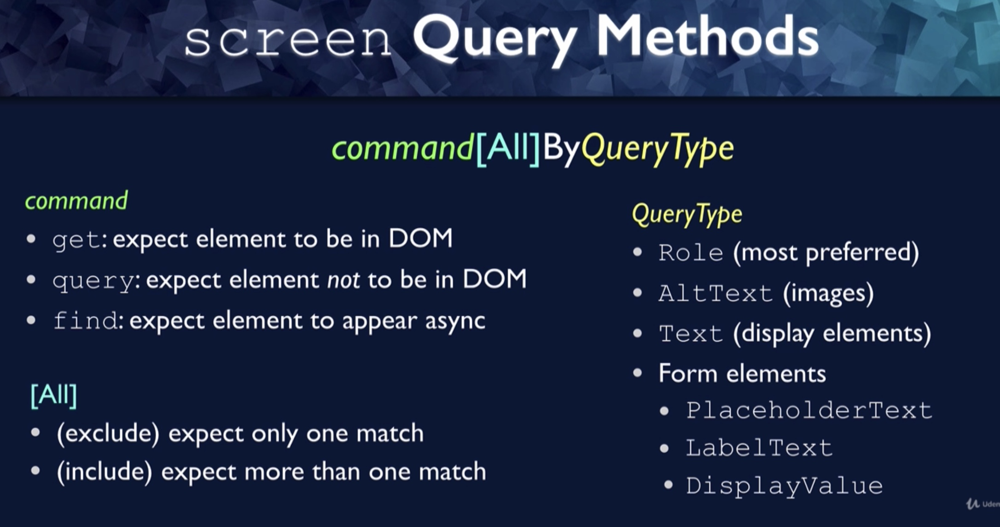

# Sundaes-On-Demand

> this app is part of [Testing React with Jest and Testing Library](https://www.udemy.com/course/react-testing-library/) on Udemy

## App Summary

- Choose ice cream flavors and toppings and submit order
- Flavors and toppings come from server
- order is sent to server


## Backdrop to Test...

- more complex user interactions
  - multiple form entry, moving through order phases
- mouseover popup
  - test that element disappears from DOM
- simulating server response
  - mock service worker
- async app updates
  - awaiting DOM changes
- global state via context

## Spoiler Alert!

- We will not be testing context implementation
  - only interested in testing behavior as seen by user
- Tests no different if we used Redux, Mobx, etc
- Only difference is the test setup
  - make sure component is wrapped in context
  - ensure functionality
  - avoid errors


<br>

## Order Phase State (App-level)


## Server

- Download from course repo
  - [link](https://github.com/bonnie/udemy-TESTING-LIBRARY/tree/master/sundae-server)
  - Follow instructions in `README.md` to install
- RESTful API, runs on port 3030
- For flavors / toppings, just sends static info
  - In a real app, would come from db
- For order, simply generates random order number 😁
- Server not needed for functional react app testing!
  - use mock-service-worker to mock responses from server

## Set up ESLint and Prettier

- `npm install eslint-plugin-testing-library eslint-plugin-jest-dom`
- remove `eslintConfig` from `package.json`
- Create `.eslintrc.json` and add standard config

## Client

- Organize components by pages

  - `test` directory for each page
  - Jest will find and run any files that ends in `.test.js`

- `src/pages/summary`

  - `OrderSummary.jsx`
  - `SummaryForm.jsx`

- `src/pages/summary/test`
  - `SummaryForm.test.jsx`

---

## Notes

### Mon, Jan 16, 2022

- Custom Render

### Mon, Dec 27, 2021

- behavior driven testing
- use Context
  - [Kent C. Dodds pattern](https://kentcdodds.com/blog/application-state-management-with-react)

#### Server Error

- use simple react-bootstrap alert
  - [Docs](https://react-bootstrap.netlify.app/components/alerts/)
- Jest Debugging Tools
  - running only one test file, one test within a file
- need to import `rest` from msw and `server` from mock server

  ```javascript
      server.resetHandlers(
    rest.get('http://localhost:3030/scoops', (req, res, ctx) =>
      res(ctx.status(500))
    ),
    rest.get('http://localhost:3030/toppings', (req, res, ctx) =>
      res(ctx.status(500))
    )
  ```

- `waitFor`
  - similar to `waitForElementToBeRemoved`, uses when you see `not wrapped in act(...)` warning

#### Review

- override Mock Service Worker response for individual tests
- unable to find `role="alert"` error => `waitFor`
- isolate file by typing `p`
- `test.only` and `test.skip` to run particular tests
- `waitFor` for tests where `await findBy*` isn't enough

### Sun, Dec 26, 2021

#### Using `userEvent` instead of `fireEvent`

#### Screen Query Methods

  

- [API Queries](https://testing-library.com/docs/dom-testing-library/api-queries/)
- [React Testing Cheatsheet](https://testing-library.com/docs/react-testing-library/cheatsheet/)
- [Query Guide](https://testing-library.com/docs/guide-which-query/)

  - Priority: Queries Accessible to Everyone => Semantic Queries => Test IDs(last resort)

#### `not wrapped in act (...)` warning

- [article to check](https://kentcdodds.com/blog/fix-the-not-wrapped-in-act-warning)
- `waitForElementToBeRemoved`: async function to check if element is removed

#### Simulating Server Response w/ Mock Service worker

- intercept network calls, return specified responses
- `yarn add --dev msw`
- Create handlers => test server => check if server listens => reset after each test

#### asynchronous tests must use `await`, `findBy`

### Wed, Dec 22, 2021

- Copy base codes for testing (pages/summary/\*)
- Write test scripts for `SummaryForm.jsx`
