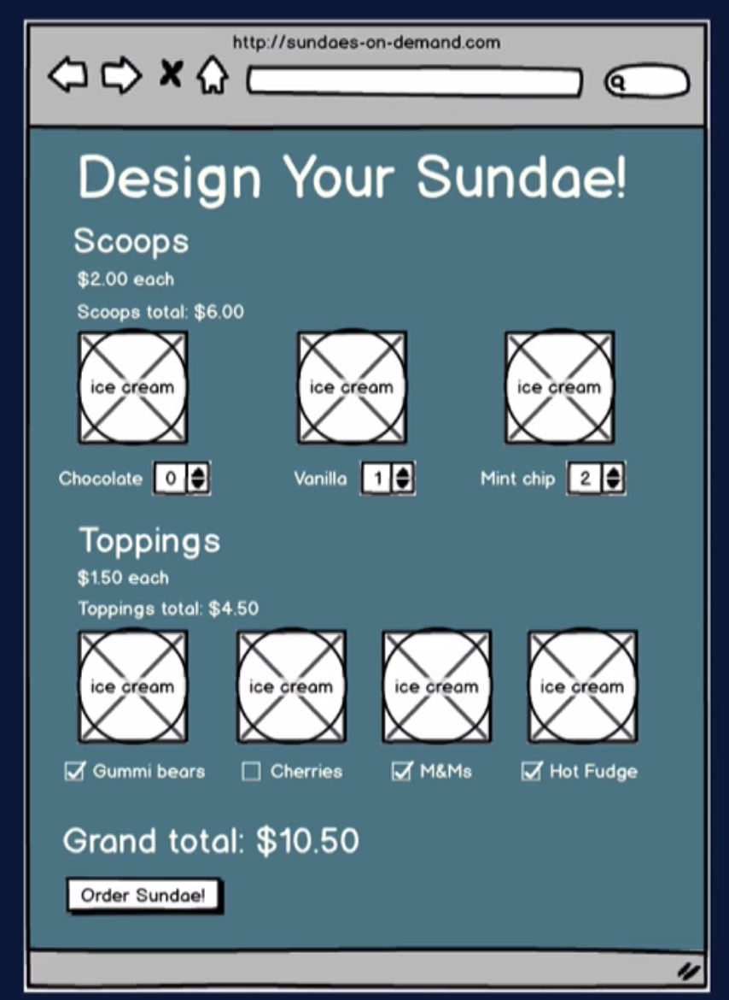
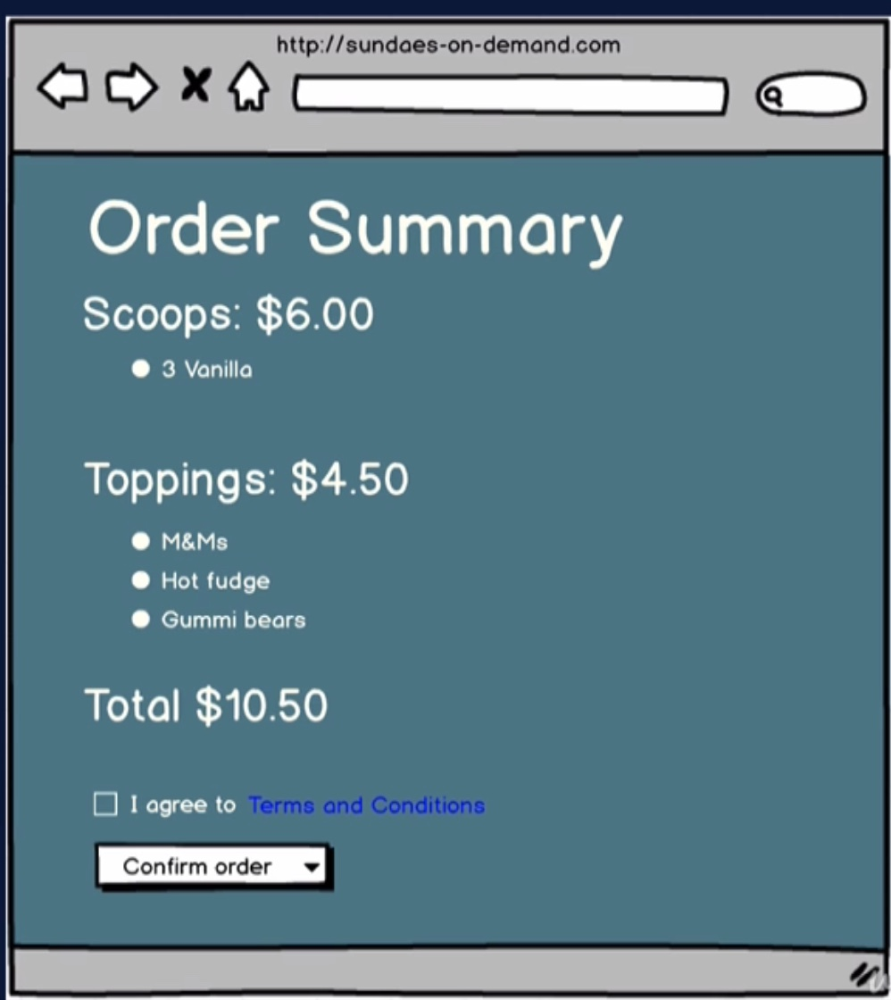
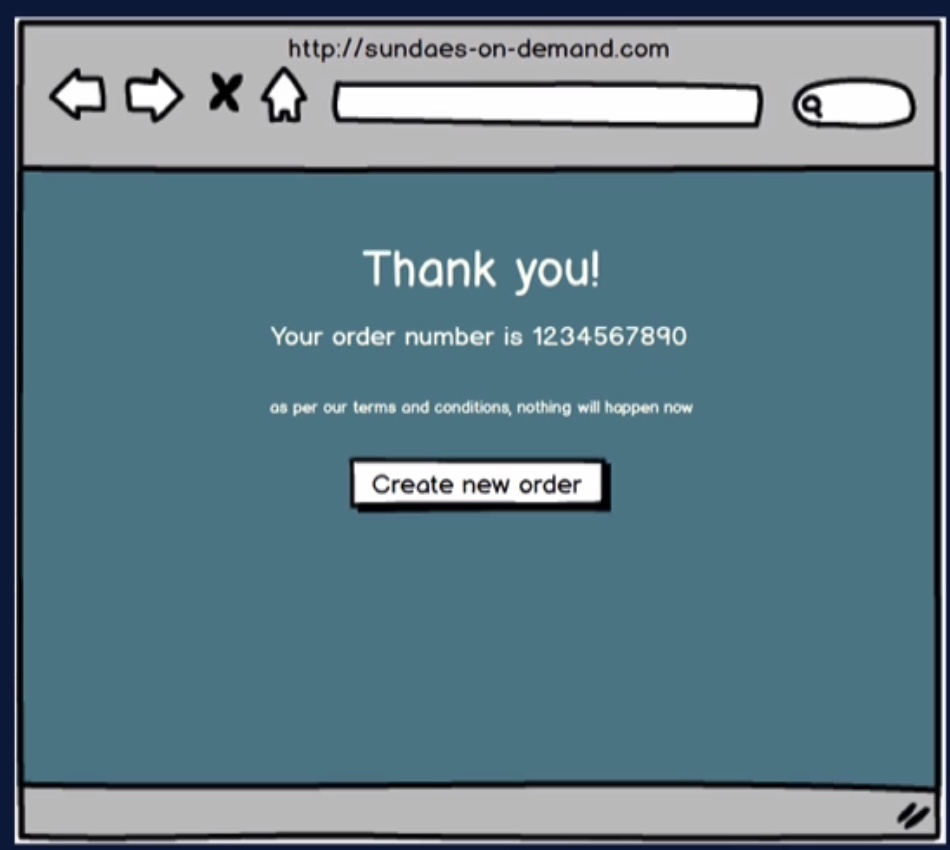
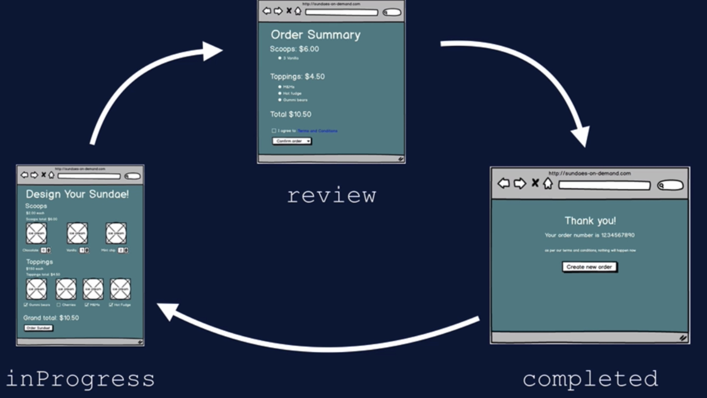

# Sundaes-On-Demand

> this app is part of [Testing React with Jest and Testing Library](https://www.udemy.com/course/react-testing-library/) on Udemy

## App Summary

- Choose ice cream flavors and toppings and submit order
- Flavors and toppings come from server
- order is sent to server

## Backdrop to Test...

- more complex user interactions
  - multiple form entry, moving through order phases
- mouseover popup
  - test that element disappears from DOM
- simulating server response
  - mock service worker
- async app updates
  - awaiting DOM changes
- global state via context

## Spoiler Alert!

- We will not be testing context implementation
  - only interested in testing behavior as seen by user
- Tests no different if we used Redux, Mobx, etc
- Only difference is the test setup
  - make sure component is wrapped in context
  - ensure functionality
  - avoid errors

 

## Order Phase State (App-level)

## Server

- Download from course repo
-
